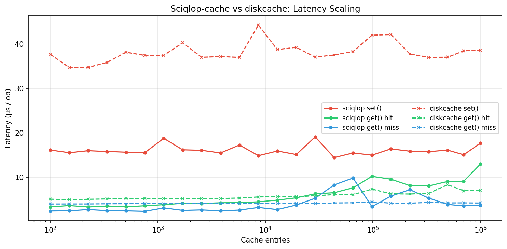
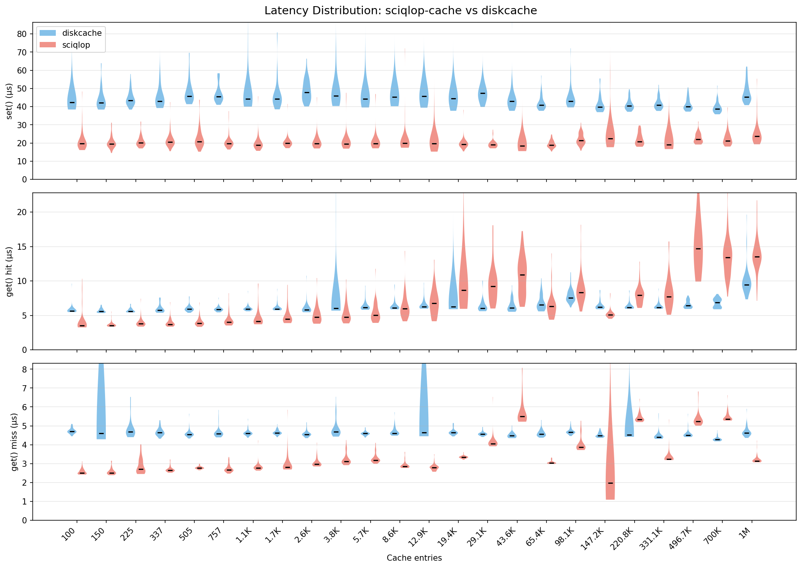

[](https://mit-license.org/)
[]()
[](https://pypi.python.org/pypi/Sciqlop-cache)
[](https://codecov.io/gh/SciQLop/Sciqlop-cache/branch/main)

# SciQLop Cache

A fast, persistent key-value cache for Python and C++20. Built on SQLite with hybrid blob/file storage, it stays flat from 100 to 1M+ entries while being **2x faster than diskcache on writes**.

```python
pip install sciqlop-cache
```

## Quick Start (Python)

```python
from pysciqlop_cache import Cache

cache = Cache("/tmp/my-cache")
cache["sensor/temperature"] = {"ts": 1710000000, "values": [21.3, 21.5, 21.4]}
print(cache["sensor/temperature"])
```

Any picklable Python object works out of the box. For better performance with structured data, use the msgspec serializer:

```python
from pysciqlop_cache import Cache, MsgspecSerializer

cache = Cache("/tmp/my-cache", serializer=MsgspecSerializer())
```

### Expiration and Tags

```python
cache.set("session/abc", token, expire=3600)          # expires in 1 hour
cache.set("sensor/temp", data, tag="sensor")           # tagged entry
cache.set("sensor/hum", data, expire=600, tag="sensor")

cache.evict_tag("sensor")   # bulk-remove all "sensor" entries
cache.expire()               # remove all expired entries
```

### LRU Eviction

```python
cache = Cache("/tmp/bounded", max_size=1_000_000_000)  # 1 GB limit
# Least-recently-used entries are evicted automatically in the background
```

### Atomic Transactions

```python
with cache.transact():
    cache["balance"] = cache.get("balance", 0) - amount
    cache["log"] = f"withdrew {amount}"
# Automatically commits on success, rolls back on exception
```

### Sharded Concurrency with FanoutCache

For write-heavy concurrent workloads, `FanoutCache` shards keys across N independent stores:

```python
from pysciqlop_cache import FanoutCache

cache = FanoutCache("/tmp/sharded", shard_count=8, max_size=1_000_000_000)
cache["key"] = "value"         # routed to shard via hash(key) % 8

with cache.transact("key"):   # transaction scoped to key's shard
    cache["key"] = transform(cache["key"])
```

### Lightweight Index

`Index` and `FanoutIndex` are bare key-value stores with no expiration, eviction, tags, or stats overhead:

```python
from pysciqlop_cache import Index

idx = Index("/tmp/my-index")
idx["dataset/v2"] = metadata
```

### Dict-like Interface

All store types support the standard Python dict interface:

```python
cache["key"] = value           # set
value = cache["key"]           # get
del cache["key"]               # delete
"key" in cache                 # exists
for key in cache: ...          # iterate keys
len(cache)                     # count
```

## C++ API

```cpp
#include "sciqlop_cache/sciqlop_cache.hpp"

// Full-featured cache with expiration, LRU eviction, tags, and stats
Cache cache(".cache/", /*max_size=*/1'000'000'000);

cache.set("key", std::vector<char>{'a', 'b', 'c'});
cache.set("key", data, 60s);                  // with expiration
cache.set("key", data, "mytag");               // with tag
cache.set("key", data, 60s, "mytag");          // both

auto value = cache.get("key");                 // std::optional<Buffer>
cache.del("key");
cache.pop("key");                              // get + delete
cache.add("key", data);                        // set only if absent
cache.touch("key", 120s);                      // update expiration
cache.evict_tag("mytag");                      // bulk remove by tag

// Bare key-value store (no expiration/eviction/tags overhead)
Index index(".index/");

// Sharded variants for write concurrency
FanoutCache fc(".fc/", /*shard_count=*/8, /*max_size=*/0);
FanoutIndex fi(".fi/", /*shard_count=*/8);
```

## Performance

Comparison with diskcache, from 100 to 1M cache entries (256-byte values):



Latency distribution at each cache size:



Reproduce with:

```bash
PYTHONPATH=build python benchmark/scaling.py --max-entries 1000000 --backend both > results.csv
python benchmark/plot_scaling.py results.csv -o benchmark/scaling_chart.png

PYTHONPATH=build python benchmark/scaling.py --max-entries 1000000 --raw --backend both > raw.csv
python benchmark/plot_scaling.py raw.csv --violin -o benchmark/scaling_violin.png
```

## Building from Source

```bash
pip install meson-python numpy
meson setup build -Dwith_tests=true
meson compile -C build
meson test -C build
```

## License

MIT
