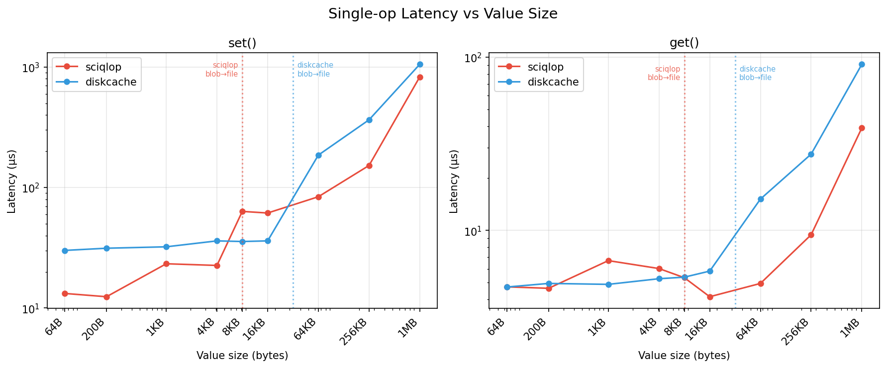
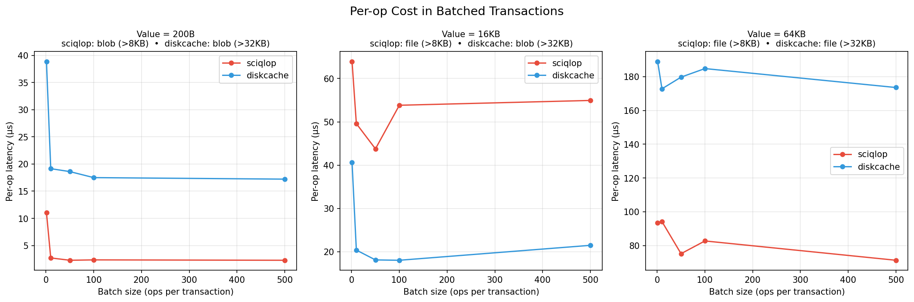

[](https://mit-license.org/)
[]()
[](https://pypi.python.org/pypi/Sciqlop-cache)
[](https://codecov.io/gh/SciQLop/Sciqlop-cache/branch/main)

# SciQLop Cache

A fast, persistent key-value cache for Python and C++20. Built on SQLite with hybrid blob/file storage, it stays flat from 100 to 1M+ entries while being **2x faster than diskcache on writes** and **up to 6x faster in batched transactions**.

```python
pip install sciqlop-cache
```

## Quick Start (Python)

```python
from pysciqlop_cache import Cache

cache = Cache("/tmp/my-cache")
cache["sensor/temperature"] = {"ts": 1710000000, "values": [21.3, 21.5, 21.4]}
print(cache["sensor/temperature"])
```

Any picklable Python object works out of the box. For better performance with structured data, use the msgspec serializer:

```python
from pysciqlop_cache import Cache, MsgspecSerializer

cache = Cache("/tmp/my-cache", serializer=MsgspecSerializer())
```

### Expiration and Tags

```python
cache.set("session/abc", token, expire=3600)          # expires in 1 hour
cache.set("sensor/temp", data, tag="sensor")           # tagged entry
cache.set("sensor/hum", data, expire=600, tag="sensor")

cache.evict_tag("sensor")   # bulk-remove all "sensor" entries
cache.expire()               # remove all expired entries
```

### LRU Eviction

```python
cache = Cache("/tmp/bounded", max_size=1_000_000_000)  # 1 GB limit
# Least-recently-used entries are evicted automatically in the background
```

### Atomic Transactions

```python
with cache.transact():
    cache["balance"] = cache.get("balance", 0) - amount
    cache["log"] = f"withdrew {amount}"
# Automatically commits on success, rolls back on exception
```

`transact()` is reentrant on the same thread, so transactional helpers compose cleanly:

```python
def withdraw(amount):
    with cache.transact():
        cache["balance"] = cache.get("balance", 0) - amount

with cache.transact():        # outer
    withdraw(50)               # nested transact is fine
    withdraw(20)
# Outer commits; if it raises, both withdraws roll back together.
```

### Sharded Concurrency with FanoutCache

For write-heavy concurrent workloads, `FanoutCache` shards keys across N independent stores:

```python
from pysciqlop_cache import FanoutCache

cache = FanoutCache("/tmp/sharded", shard_count=8, max_size=1_000_000_000)
cache["key"] = "value"         # routed to shard via hash(key) % 8

with cache.transact("key"):   # transaction scoped to key's shard
    cache["key"] = transform(cache["key"])
```

### Lightweight Index

`Index` and `FanoutIndex` are bare key-value stores with no expiration, eviction, tags, or stats overhead:

```python
from pysciqlop_cache import Index

idx = Index("/tmp/my-index")
idx["dataset/v2"] = metadata
```

### Distributed Locking

```python
# Cross-process lock backed by atomic add()
with cache.lock("my-resource", expire=30):
    # exclusive access across processes
    do_work()
```

### Memoization

```python
@cache.memoize(expire=300, tag="compute")
def expensive(x, y):
    return heavy_computation(x, y)

expensive(1, 2)  # computed
expensive(1, 2)  # served from cache
```

### Atomic Counters

```python
cache.incr("page_views")             # 1
cache.incr("page_views", delta=5)    # 6
cache.decr("page_views")             # 5
```

### Hit/Miss Statistics

```python
cache = Cache("/tmp/stats")
cache.set("k", "v")
cache.get("k")          # hit
cache.get("missing")    # miss
print(cache.stats())    # {"hits": 1, "misses": 1}
cache.reset_stats()
```

### Integrity Checking

```python
result = cache.check()       # verify structural integrity
result = cache.check(True)   # verify and fix (orphaned files, counter drift)
print(result.ok, result.orphaned_files, result.dangling_rows)
```

### Disk Usage

```python
print(cache.volume())  # total bytes on disk (SQLite DB + file-backed values)
print(cache.size())    # total bytes of stored values only
```

### Dict-like Interface

All store types support the standard Python dict interface:

```python
cache["key"] = value           # set
value = cache["key"]           # get
del cache["key"]               # delete
"key" in cache                 # exists
for key in cache: ...          # iterate keys
len(cache)                     # count
```

## Migrating from diskcache

```bash
# Migrate an existing diskcache Cache or FanoutCache
python -m pysciqlop_cache.migrate /old/diskcache /new/sciqlop-cache

# Migrate a diskcache Index
python -m pysciqlop_cache.migrate --type index /old/index /new/index

# Migrate and delete entries from source as they are copied
python -m pysciqlop_cache.migrate --drop /old/diskcache /new/sciqlop-cache
```

Auto-detects `Cache` vs `FanoutCache`, preserves expiration TTLs and tags. Use `--type index` for `Index` sources (creates a lightweight sciqlop-cache `Index`). Also usable as a library:

```python
from pysciqlop_cache.migrate import migrate
result = migrate("/old/cache", "/new/cache", drop=True)
result = migrate("/old/index", "/new/index", store_type="index")
print(result)  # {"migrated": 1234, "skipped": 0, "errors": 0, "elapsed_secs": 1.5}
```

## C++ API

```cpp
#include "sciqlop_cache/sciqlop_cache.hpp"

// Full-featured cache with expiration, LRU eviction, tags, and stats
Cache cache(".cache/", /*max_size=*/1'000'000'000);

cache.set("key", std::vector<char>{'a', 'b', 'c'});
cache.set("key", data, 60s);                  // with expiration
cache.set("key", data, "mytag");               // with tag
cache.set("key", data, 60s, "mytag");          // both

auto value = cache.get("key");                 // std::optional<Buffer>
cache.del("key");
cache.pop("key");                              // get + delete
cache.add("key", data);                        // set only if absent
cache.touch("key", 120s);                      // update expiration
cache.evict_tag("mytag");                      // bulk remove by tag

// Bare key-value store (no expiration/eviction/tags overhead)
Index index(".index/");

// Atomic counters
cache.incr("counter", 1, /*default=*/0);
cache.decr("counter");

// Integrity and diagnostics
auto cr = cache.check();         // structural integrity
auto cr2 = cache.check(true);    // verify and fix
cache.volume();                  // total disk usage in bytes
cache.stats();                   // {hits, misses}

// Sharded variants for write concurrency
FanoutCache fc(".fc/", /*shard_count=*/8, /*max_size=*/0);
FanoutIndex fi(".fi/", /*shard_count=*/8);
```

## Concurrency

- **Thread-safe**: per-instance mutex + per-instance SQLite connection. Multiple threads can share a single `Cache` instance.
- **Multi-process safe**: SQLite WAL mode with 600s busy timeout. Multiple processes can open the same cache directory.
- **FanoutCache/FanoutIndex**: shard keys across N independent stores for write concurrency. Each shard has its own database and lock.

## Performance

### Latency scaling (100 to 1M entries, 256-byte values)


### Latency vs value size (64B to 1MB)



### Batched transactions (per-op cost)

Amortized per-op latency drops significantly with larger batches, especially for small values:



### Reproduce

```bash
# Scaling benchmarks
PYTHONPATH=build python benchmark/scaling.py --max-entries 1000000 --backend both > results.csv
python benchmark/plot_scaling.py results.csv -o benchmark/scaling_chart.png

PYTHONPATH=build python benchmark/scaling.py --max-entries 1000000 --raw --backend both > raw.csv
python benchmark/plot_scaling.py raw.csv --violin -o benchmark/scaling_violin.png

# Value-size and batch benchmarks
PYTHONPATH=build python benchmark/bench_valuesize.py > benchmark/valuesize_results.csv
python benchmark/plot_valuesize.py benchmark/valuesize_results.csv -o benchmark
```

## Building from Source

```bash
pip install meson-python numpy
meson setup build -Dwith_tests=true
meson compile -C build
meson test -C build
```

## License

MIT
