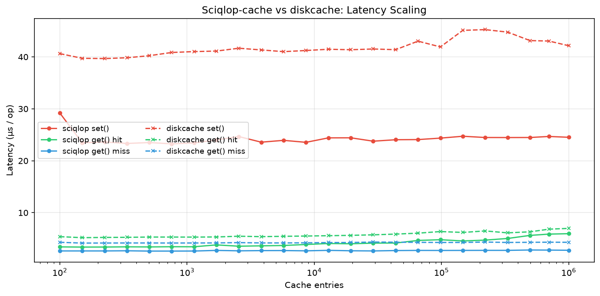
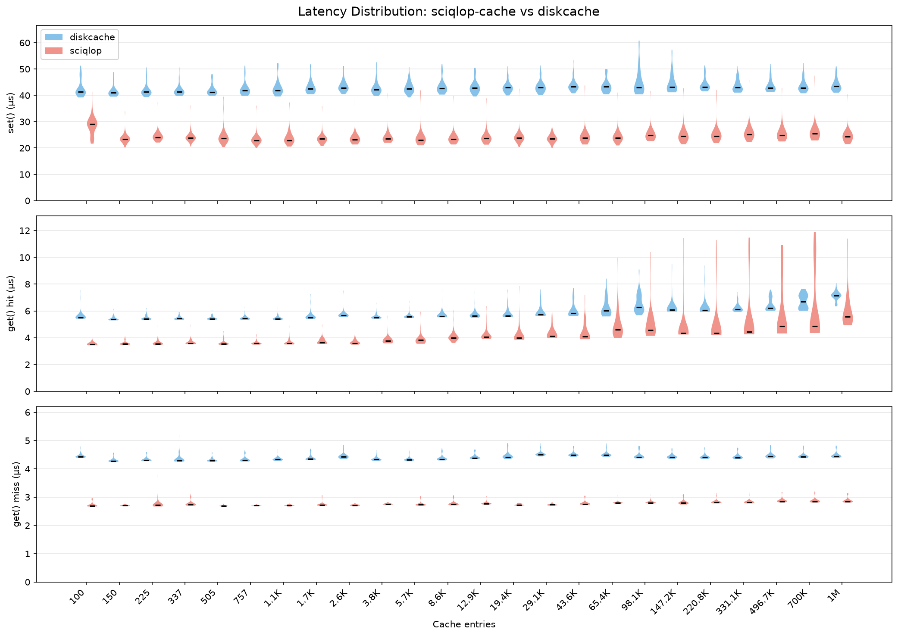
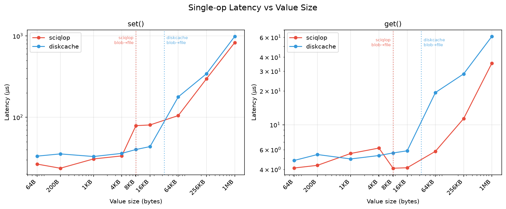
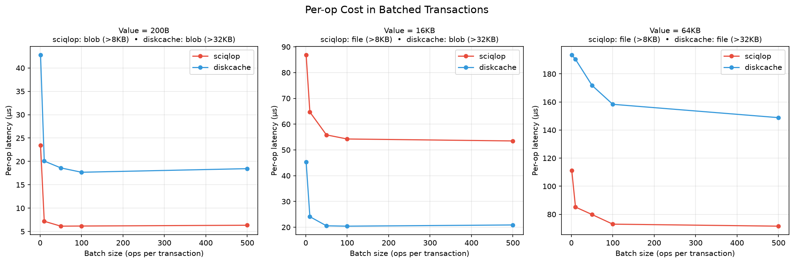
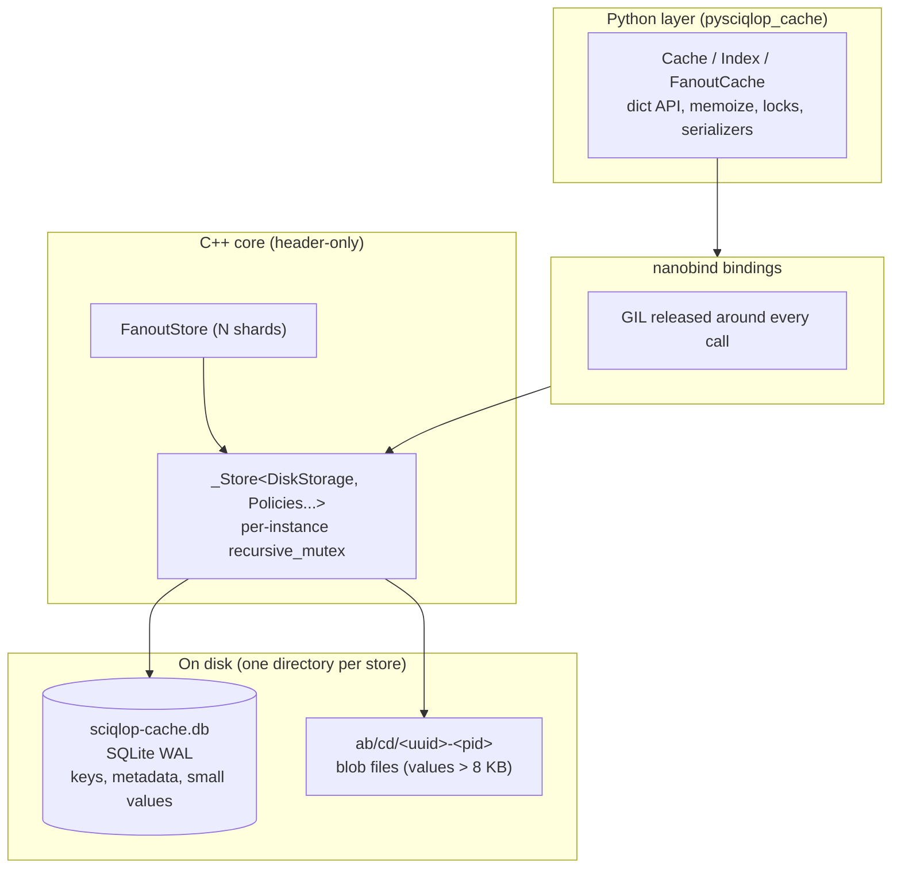
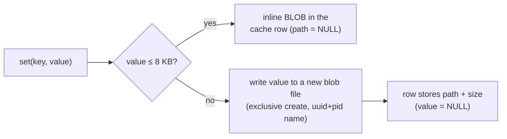
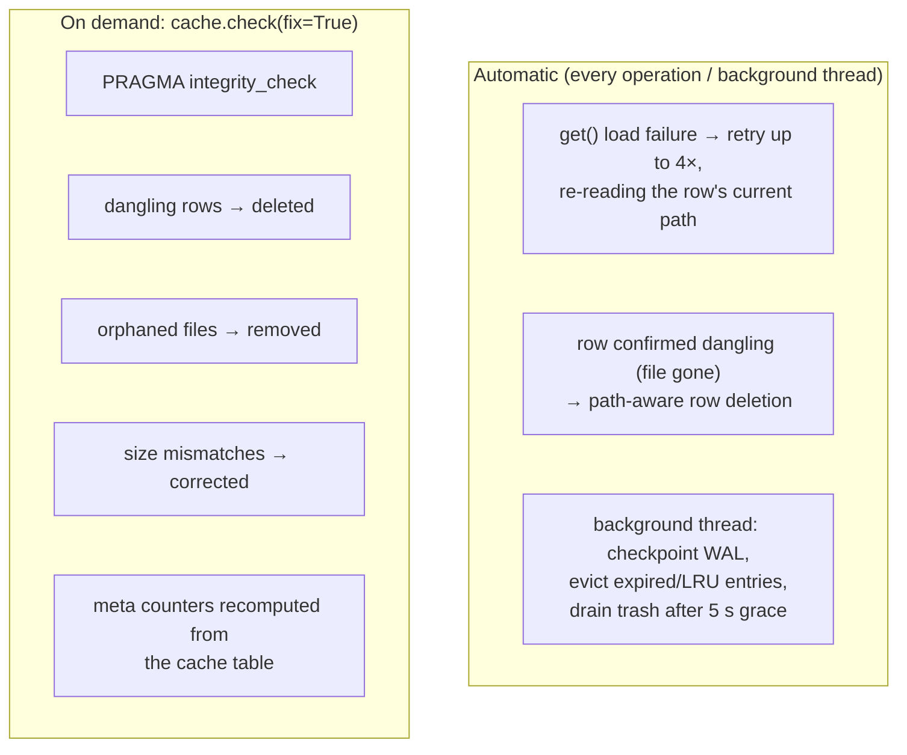

[](https://mit-license.org/)
[]()
[](https://pypi.org/project/pysciqlop-cache/)
[](https://codecov.io/gh/SciQLop/Sciqlop-cache/branch/main)

# SciQLop Cache

**A fast, persistent, process-safe key-value cache for Python (with a C++20 core).**

Think of it as a tiny local database for expensive-to-recompute things: you store
Python objects under string keys, and any thread or process on the machine can
read them back — safely, even at the same time. It stays flat from 100 to 1M+
entries, is **2x faster than diskcache on writes** and **up to 6x faster in
batched transactions**, and it never corrupts your data when processes crash,
fork, or race each other.

```bash
pip install pysciqlop-cache
```

```python
from pysciqlop_cache import Cache

cache = Cache("/tmp/my-cache")
cache["sensor/temperature"] = {"ts": 1710000000, "values": [21.3, 21.5, 21.4]}

print(cache["sensor/temperature"])
# {'ts': 1710000000, 'values': [21.3, 21.5, 21.4]}
```

Any picklable Python object works out of the box.

## Why use it?

- **Persistent** — data survives process restarts; open the same directory and it's all there.
- **Safe to share** — multiple threads *and* multiple processes (including forked worker pools) can hit the same cache concurrently. No corruption, no lock files, no setup.
- **Bounded** — optional size limit with automatic LRU eviction, optional per-key expiration, and tag-based bulk eviction.
- **Fast** — small values live inside SQLite; large values are memory-mapped files, so reading a 100 MB array costs ~zero copies.
- **Self-healing** — crashes, races and interrupted writes are detected and repaired automatically or via `cache.check(fix=True)`.

## The 5-minute tour

### It behaves like a dict

```python
cache["key"] = value        # set
value = cache["key"]        # get (None if missing)
del cache["key"]            # delete
"key" in cache              # exists
for key in cache: ...       # iterate keys
len(cache)                  # entry count
```

### Expiration and tags

```python
cache.set("session/abc", token, expire=3600)        # expires in 1 hour
cache.set("sensor/temp", data, tag="sensor")        # tagged entry
cache.set("sensor/hum", data, expire=600, tag="sensor")

cache.evict_tag("sensor")   # bulk-remove all "sensor" entries
cache.touch("session/abc", expire=3600)             # extend lifetime
```

### Bounded caches (LRU eviction)

```python
cache = Cache("/tmp/bounded", max_size=1_000_000_000)   # 1 GB limit
# least-recently-used entries are evicted automatically in the background
```

### Memoization — cache function results in one line

```python
@cache.memoize(expire=300, tag="compute")
def expensive(x, y):
    return heavy_computation(x, y)

expensive(1, 2)   # computed
expensive(1, 2)   # served from cache
```

Keys are derived from the function's module + qualified name and a SHA-256 of
the serialized arguments. Use `typed=True` to distinguish `f(1)` from `f(1.0)`,
and `version_aware=True` to automatically invalidate entries when the
function's bytecode changes.

### Atomic counters and transactions

```python
cache.incr("page_views")              # 1
cache.incr("page_views", delta=5)     # 6
cache.decr("page_views")              # 5

with cache.transact():
    cache["balance"] = cache.get("balance", 0) - amount
    cache["log"] = f"withdrew {amount}"
# commits on success, rolls back on exception — reentrant, so
# transactional helpers nest cleanly
```

### Cross-process locks

```python
with cache.lock("my-resource", expire=30):
    do_work()   # exclusive across processes and threads
```

### Heavy concurrent writers: FanoutCache

A single SQLite store serializes writers. If many processes write heavily,
shard the keyspace across N independent stores:

```python
from pysciqlop_cache import FanoutCache

cache = FanoutCache("/tmp/sharded", shard_count=8, max_size=1_000_000_000)
cache["key"] = "value"                 # routed to shard hash(key) % 8

with cache.transact("key"):            # transaction scoped to key's shard
    cache["key"] = transform(cache["key"])
```

### A lightweight store: Index

`Index` / `FanoutIndex` are the same storage engine without expiration,
eviction, tags or stats — less per-write overhead when you just need a
persistent dict:

```python
from pysciqlop_cache import Index

idx = Index("/tmp/my-index")
idx["dataset/v2"] = metadata
```

### Observability and maintenance

```python
cache.stats()                  # {"hits": 1, "misses": 1}
cache.volume()                 # total bytes on disk (DB + blob files)
cache.size()                   # bytes of stored values only

result = cache.check()         # verify structural integrity
result = cache.check(True)     # ... and repair (orphaned files, counter drift)
print(result.ok, result.orphaned_files, result.dangling_rows)
```

### Serializers

Pickle is the default (any Python object). For structured data, msgspec is
faster and safer:

```python
from pysciqlop_cache import Cache, MsgspecSerializer

cache = Cache("/tmp/my-cache", serializer=MsgspecSerializer())
```

The serializer choice is recorded in the cache itself: reopening a cache with a
different serializer raises instead of silently misreading your data.

## Migrating from diskcache

```bash
# Migrate an existing diskcache Cache or FanoutCache (auto-detected)
python -m pysciqlop_cache.migrate /old/diskcache /new/sciqlop-cache

# Migrate a diskcache Index
python -m pysciqlop_cache.migrate --type index /old/index /new/index

# Migrate and delete entries from source as they are copied
python -m pysciqlop_cache.migrate --drop /old/diskcache /new/sciqlop-cache
```

Preserves expiration TTLs and tags. Also usable as a library:

```python
from pysciqlop_cache.migrate import migrate
result = migrate("/old/cache", "/new/cache", drop=True)
print(result)  # {"migrated": 1234, "skipped": 0, "errors": 0, "elapsed_secs": 1.5}
```

## C++ API

The same engine is usable directly from C++20 (header-only interface,
single `sciqlop_cache` dependency via meson):

```cpp
#include "sciqlop_cache/sciqlop_cache.hpp"

Cache cache(".cache/", /*max_size=*/1'000'000'000);

cache.set("key", data);                 // data: any contiguous byte range
cache.set("key", data, 60s);            // with expiration
cache.set("key", data, "mytag");        // with tag

auto value = cache.get("key");          // std::optional<Buffer>
cache.del("key");
cache.pop("key");                       // get + delete
cache.add("key", data);                 // set only if absent
cache.touch("key", 120s);
cache.evict_tag("mytag");
cache.incr("counter", 1, /*default=*/0);

Index index(".index/");                 // bare store, no policy overhead
FanoutCache fc(".fc/", /*shard_count=*/8, /*max_size=*/0);
```

## Performance

### Latency scaling (100 to 1M entries, 256-byte values)





### Latency vs value size (64B to 1MB)



### Batched transactions (per-op cost)

Amortized per-op latency drops significantly with larger batches, especially for small values:



<details>
<summary>Reproduce the benchmarks</summary>

```bash
# Scaling benchmarks
PYTHONPATH=build python benchmark/scaling.py --max-entries 1000000 --backend both > results.csv
python benchmark/plot_scaling.py results.csv -o benchmark/scaling_chart.png

PYTHONPATH=build python benchmark/scaling.py --max-entries 1000000 --raw --backend both > raw.csv
python benchmark/plot_scaling.py raw.csv --violin -o benchmark/scaling_violin.png

# Value-size and batch benchmarks
PYTHONPATH=build python benchmark/bench_valuesize.py > benchmark/valuesize_results.csv
python benchmark/plot_valuesize.py benchmark/valuesize_results.csv -o benchmark
```

</details>

## Building from source

```bash
pip install meson-python numpy
meson setup build -Dwith_tests=true
meson compile -C build
meson test -C build                   # full suite (~10 min; includes stress tests)
meson test -C build --no-suite slow   # daily loop (~90 s)
```

## License

MIT

---

# How it works (the internals)

Everything below is for readers who want to know *why* they can trust this
thing. No need to read it to use the library.

## The big picture


```mermaid
flowchart TB
    subgraph PY["Python layer (pysciqlop_cache)"]
        API["Cache / Index / FanoutCache<br/>dict API, memoize, locks, serializers"]
    end
    subgraph NB["nanobind bindings"]
        GIL["GIL released around every call"]
    end
    subgraph CORE["C++ core (header-only)"]
        STORE["_Store&lt;DiskStorage, Policies...&gt;<br/>per-instance recursive_mutex"]
        FS["FanoutStore (N shards)"]
    end
    subgraph DISK["On disk (one directory per store)"]
        DB[("sciqlop-cache.db<br/>SQLite WAL<br/>keys, metadata, small values")]
        BLOBS["ab/cd/&lt;uuid&gt;-&lt;pid&gt;<br/>blob files (values &gt; 8 KB)"]
    end
    API --> NB --> STORE --> DB
    STORE --> BLOBS
    FS --> STORE
```

One cache = one directory containing a SQLite database plus zero or more blob
files. Python never touches disk directly; every operation goes through the C++
`_Store`, which is composed at compile time from policy mixins
(`WithExpiration`, `WithEviction`, `WithTags`, `WithStats`) — `Index` is simply
`_Store` with no policies, so a bare store pays zero overhead for features it
doesn't use.

## How data is stored: hybrid blob/file storage

Values take one of two paths, chosen by size (threshold: 8 KB):


```mermaid
flowchart LR
    S["set(key, value)"] --> Q{value ≤ 8 KB?}
    Q -->|yes| B["inline BLOB in the<br/>cache row (path = NULL)"]
    Q -->|no| F["write value to a new blob file<br/>(exclusive create, uuid+pid name)"]
    F --> R["row stores path + size<br/>(value = NULL)"]
```

- **Small values (≤ 8 KB)** are stored inline in the SQLite row. One
  transaction, nothing else on disk.
- **Large values (> 8 KB)** are written to their own file, named
  `<uuid>-<pid>` and spread over a two-level directory fanout (`ab/cd/…`) so
  no directory grows unwieldy. The row keeps the *relative* path, so the whole
  cache directory can be moved or copied and still resolves.
- **Reads** of file-backed values are memory-mapped — the bytes are never
  copied into Python until you actually use them. A small LRU cache keeps the
  last 128 mappings open to avoid `mmap`/`munmap` churn.

Why not put everything in SQLite? Large blobs would churn the WAL (every write
goes through it) and force a memory copy on every read. Files + mmap avoid both.

### The write path in detail

```mermaid
sequenceDiagram
    participant U as Your code
    participant S as _Store
    participant D as DiskStorage
    participant Q as SQLite (WAL)

    U->>S: set(key, big_value)
    S->>S: lock _mtx, BEGIN EXCLUSIVE
    S->>Q: SELECT old path/size for key
    S->>D: store(value)
    D->>D: open ab/cd/<uuid>-<pid> O_CREAT|O_EXCL
    alt path already exists (astronomically rare)
        D->>Q: is it referenced? (cache or trash table)
        Q-->>D: yes -> new random name, retry; no -> overwrite in place
    end
    D-->>S: relative path
    S->>Q: REPLACE INTO cache (key, path, size, …)
    S->>Q: INSERT old path INTO trash (same txn)
    S->>Q: COMMIT
    Note over S,Q: row change and trash entry<br/>commit or roll back together
```

Three properties fall out of this ordering:

1. **A row only ever points at a complete file** — the file is fully written
   and closed before the row referencing it commits.
2. **Displaced files are never deleted inline** — the old path goes into a
   `trash` table in the *same transaction*, and a background thread unlinks it
   after a 5-second grace period. A reader in another process that grabbed the
   old path microseconds before the commit can still open the file.
3. **Filenames are structurally unique per store** — random UUID *plus* the
   process id, created with `O_EXCL` so a duplicate can never silently
   overwrite live data. The collision-healing path exists for completeness and
   is fully exercised by tests, but you will likely never see it run.

## Thread safety

- Every `_Store` instance has a single `std::recursive_mutex`; all public
  operations take it. Sharing one `Cache` between Python threads is safe.
- The nanobind bindings **release the GIL** around every call into C++, so a
  thread blocked on the store mutex never starves other Python threads.
- The mmap-handle LRU cache has its own tiny mutex because the background
  thread can drop handles without holding the store lock.
- Key iteration uses a snapshot cursor: all keys are pulled under the lock in
  one shot, then iterated lock-free — iteration never blocks writers.

## Process safety

Multiple processes can open the same cache directory concurrently. This works
because:

- SQLite runs in **WAL mode** with a 600 s busy timeout — readers never block
  writers and vice versa; writers serialize cleanly.
- Compound operations (`set` replacing an entry, `del`, `pop`, tag eviction)
  run inside **`BEGIN EXCLUSIVE` transactions**, so the read-then-write
  sequences that would race across processes are atomic.
- Deletion is path-aware: cleanup after a failed load runs
  `DELETE … WHERE key = ? AND path = ?`, so a process can never delete another
  process's freshly-committed row by mistake.
- File removal after delete/evict checks that the row actually disappeared
  (`sqlite3_changes`) before unlinking — a lost busy-timeout race orphans a
  file (harmless, cleaned up by `check()`) instead of dangling a row (data
  loss).

### Fork safety

`fork()` clones only the calling thread — a naive child inherits locked mutexes
and a broken WAL connection. SciQLop Cache registers every live store with
`pthread_atfork`:

- **prepare** (pre-fork): the background thread is stopped and joined, and the
  store mutex is taken, so the fork happens in a quiesced state.
- **parent**: everything resumes.
- **child**: the mutex is reinitialised, the SQLite connection is reopened from
  scratch, the background thread is restarted — and the blob-filename RNG is
  **reseeded** (this matters: without it, parent and children would generate
  identical UUID sequences and different keys' values could land on the same
  file; the pid suffix in the filename is a second, structural guarantee).

Both one-shot `fork → touch → exit` patterns and long-lived reused worker pools
(`multiprocessing.Pool` with the fork start method) are covered by regression
tests. See `docs/known-issues/` for the full investigations.

## Self-healing

The design assumes crashes and races *will* happen and makes them cheap:


```mermaid
flowchart TB
    subgraph automatic["Automatic (every operation / background thread)"]
        R1["get() load failure → retry up to 4×,<br/>re-reading the row's current path"]
        R2["row confirmed dangling (file gone)<br/>→ path-aware row deletion"]
        R3["background thread: checkpoint WAL,<br/>evict expired/LRU entries,<br/>drain trash after 5 s grace"]
    end
    subgraph ondemand["On demand: cache.check(fix=True)"]
        C1["PRAGMA integrity_check"]
        C2["dangling rows → deleted"]
        C3["orphaned files → removed"]
        C4["size mismatches → corrected"]
        C5["meta counters recomputed from<br/>the cache table"]
    end
```

- **Crash mid-write**? The uncommitted row never pointed at the file; the
  orphaned file is found by `check()` (and contributes nothing to `volume()`).
- **Crash after commit, before trash drain**? The trash entry is durable; the
  next process's background thread finishes the deletion.
- **Counters** (`count`, `size`, `file_size`) are maintained by SQL triggers
  in the same transaction as every row change, reconciled once against ground
  truth on open (versioned by a `counters_v` marker), and verified by
  `check()`.
- **A transient error never becomes data loss**: if a file exists but can't be
  opened (fd exhaustion, permissions), `get()` reports a soft miss and keeps
  the row.

## Eviction, expiration and the background thread

Each store runs a low-priority background thread that, roughly once per second:

1. passively checkpoints the WAL (the writer connection's own
   `wal_autocheckpoint` finishes the job under heavy write load, bounding the
   WAL at ~18 MB),
2. deletes expired entries (and, if `max_size` is set and exceeded, evicts
   least-recently-used entries down to 90 % of the limit),
3. drains the trash table.

Files are only unlinked after their row is confirmed deleted — never before.

## Durability and consistency settings

For the curious, the exact pragmas every connection runs with:
`journal_mode=WAL`, `synchronous=NORMAL`, `wal_autocheckpoint=4000`,
`cache_size=10000`, `temp_store=MEMORY`, `mmap_size=256MB`,
`busy_timeout=600000`, `recursive_triggers=ON`. This trades
last-transaction-on-power-loss durability (the default `synchronous=FULL`
guarantee) for large throughput; a process crash or clean exit loses nothing.

## Tested so you don't have to think about it

The suite includes multi-process stress tests, fork-safety reproducers for
every historical bug (kept as `docs/known-issues/*.md` post-mortems),
torture tests tagged `slow`, property-based (hypothesis) tests, and
thread-sanitizer builds. If a failure mode ever ships to production, it comes
back as a regression test.
