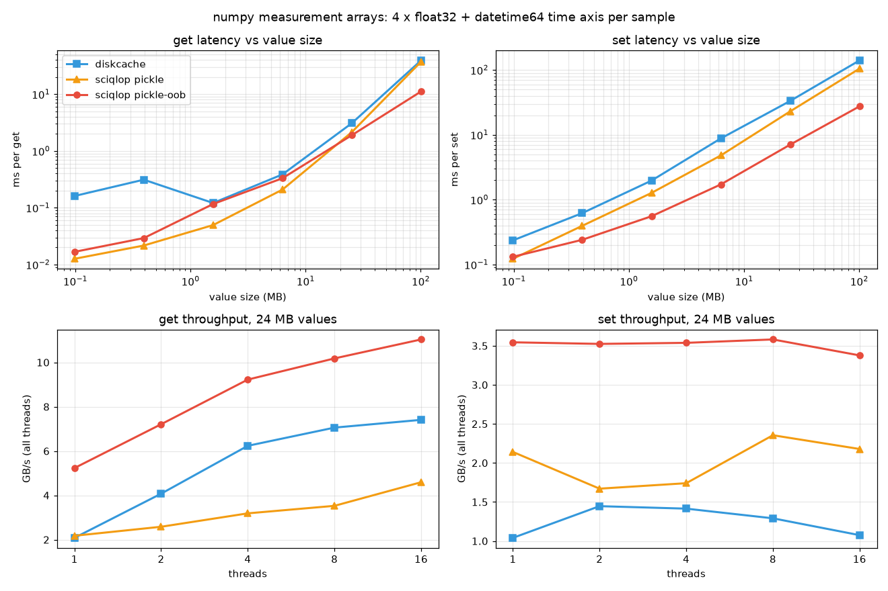

[](https://mit-license.org/)
[]()
[](https://pypi.org/project/pysciqlop-cache/)
[](https://codecov.io/gh/SciQLop/Sciqlop-cache/branch/main)
[](https://sciqlop-cache.readthedocs.io/en/latest/?badge=latest)

# SciQLop Cache

**A fast, persistent, process-safe key-value cache for Python (with a C++20 core).**

Think of it as a tiny local database for expensive-to-recompute things: you store
Python objects under string keys, and any thread or process on the machine can
read them back — safely, even at the same time. It stays flat from 100 to 1M+
entries, is **2x faster than diskcache on writes** and **up to 6x faster in
batched transactions**, and it never corrupts your data when processes crash,
fork, or race each other.

```bash
pip install pysciqlop-cache
```

📖 **[Documentation](https://sciqlop-cache.readthedocs.io/en/latest/)**: quickstart, guides for threads and processes, big numpy arrays and diskcache migration, API reference, C++ guide and internals.

```python
from pysciqlop_cache import Cache

cache = Cache("/tmp/my-cache")
cache["sensor/temperature"] = {"ts": 1710000000, "values": [21.3, 21.5, 21.4]}

print(cache["sensor/temperature"])
# {'ts': 1710000000, 'values': [21.3, 21.5, 21.4]}
```

Any picklable Python object works out of the box.

## Why use it?

- **Persistent** — data survives process restarts; open the same directory and it's all there.
- **Safe to share** — multiple threads *and* multiple processes (including forked worker pools) can hit the same cache concurrently. No corruption, no lock files, no setup.
- **Bounded** — optional size limit with automatic LRU eviction, optional per-key expiration, and tag-based bulk eviction.
- **Fast** — small values live inside SQLite; large values are memory-mapped files, so reading a 100 MB array costs ~zero copies.
- **Built for big arrays** — the `PickleOOBSerializer` moves numpy array bytes in C++ without holding the GIL, and compresses them when it pays off, so threads loading data don't block each other ([details](https://sciqlop-cache.readthedocs.io/en/latest/serializers.html)).
- **Self-healing** — crashes, races and interrupted writes are detected and repaired automatically or via `cache.check(fix=True)`.

## Learn more

| | |
|---|---|
| [Quickstart](https://sciqlop-cache.readthedocs.io/en/latest/quickstart.html) | dict API, expiration and tags, size limits, memoization, transactions |
| [Choosing a store](https://sciqlop-cache.readthedocs.io/en/latest/stores.html) | `Cache`, `Index`, `FanoutCache`, `FanoutIndex` |
| [Threads, processes and transactions](https://sciqlop-cache.readthedocs.io/en/latest/concurrency.html) | what is safe, what runs in parallel, locks |
| [Serializers](https://sciqlop-cache.readthedocs.io/en/latest/serializers.html) | pickle, msgspec, and `PickleOOBSerializer` for big numpy arrays |
| [Coming from diskcache](https://sciqlop-cache.readthedocs.io/en/latest/diskcache.html) | one-command migration, API differences |
| [C++ guide](https://sciqlop-cache.readthedocs.io/en/latest/cpp.html) | the same engine from C++20 |
| [Performance](https://sciqlop-cache.readthedocs.io/en/latest/performance.html) | benchmarks against diskcache |
| [How it works](https://sciqlop-cache.readthedocs.io/en/latest/internals.html) | storage, crash and fork safety, self-healing |
| [API reference](https://sciqlop-cache.readthedocs.io/en/latest/api.html) | every class and method |

## Performance

Measured against diskcache, both with their default settings, on a RAM filesystem.
Numpy measurement arrays from 100 KB to 100 MB, and 1 to 16 threads:



More charts and the methodology are in the [performance page](https://sciqlop-cache.readthedocs.io/en/latest/performance.html).

## Building from source

```bash
pip install .                           # or, for development:
meson setup build -Dwith_tests=true
meson compile -C build
meson test -C build
```

See [installation](https://sciqlop-cache.readthedocs.io/en/latest/installation.html) for the build options.

## License

MIT
