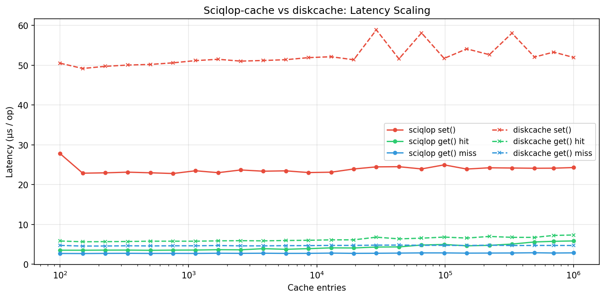
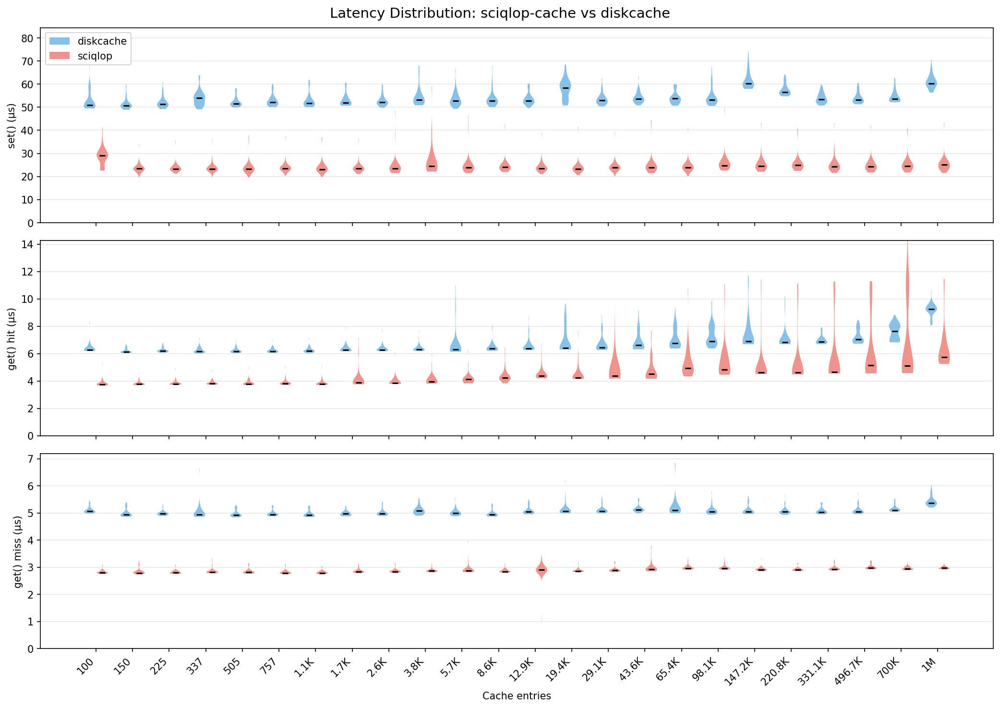
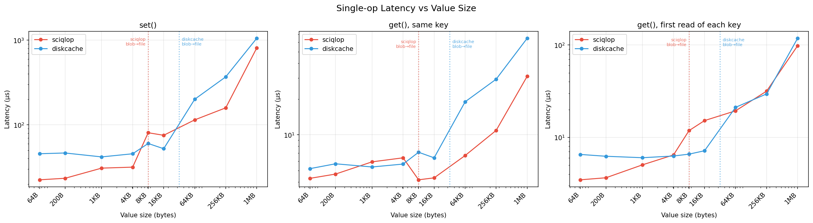
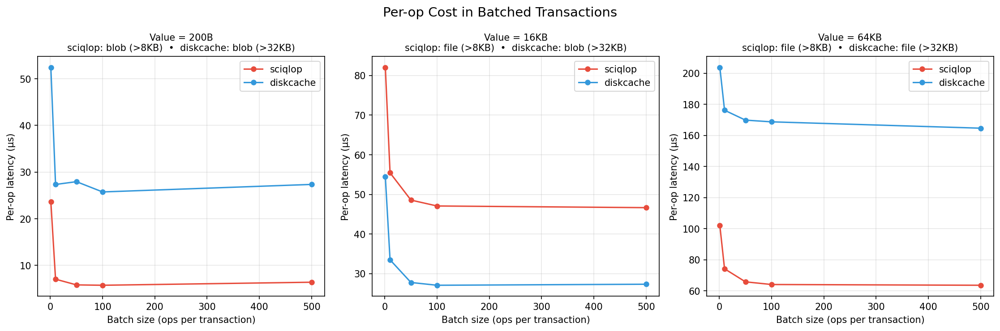

===========
Performance
===========

These benchmarks compare SciQLop Cache with `diskcache
<https://grantjenks.com/docs/diskcache/>`_. Each library runs **with its default
settings**, so the gaps come from the implementations.

**Held identical for both libraries:**

- The same machine, Python interpreter and benchmark process.
- The same storage: a RAM filesystem (``tmpfs``), so disk speed doesn't hide the
  library's own cost.
- The same keys, values and number of operations, through the public Python API.
- SQLite in WAL mode with ``synchronous=NORMAL`` for both.

**Left at each library's default (the differences being measured):**

.. list-table::
    :header-rows: 1

    * -
      - SciQLop Cache
      - diskcache
    * - Engine
      - C++ core, nanobind bindings
      - pure Python on ``sqlite3``
    * - Values stored as files above
      - 8 KB
      - 32 KB
    * - Size limit, eviction
      - unlimited; LRU when a limit is set
      - 1 GiB, least-recently-stored

**Machine:** AMD Ryzen 7 5800X (8 cores, 16 threads), 63 GiB RAM, Fedora Linux 44,
``tmpfs``, Python 3.14 (GIL build), diskcache 5.6.3.

Scaling with the number of entries
==================================

100 to 1 M entries of 256 bytes. Latency stays flat as the cache grows:

Latency vs value size
=====================

Raw ``bytes`` values from 64 B to 1 MB:

Batched transactions
====================

Writing many values in one ``transact()`` block spreads the commit cost over the batch.
The per-operation cost drops sharply, especially for small values:

numpy arrays
============

Here the values are measurement series: float32 samples (4 per row) plus a datetime64
time axis, from 100 KB to 100 MB each. All three store them with pickle protocol 5.
diskcache and the default serializer keep the array bytes inside the pickle;
:class:`~pysciqlop_cache.PickleOOBSerializer` stores them next to it, compressed when that
pays off (see :doc:`serializers`).

.. image:: ../benchmark/arrays_chart.png
    :alt: numpy arrays: diskcache vs pickle vs pickle-oob

- **Writes:** pickle-oob is the fastest from 400 KB up, and ~5x faster than diskcache at
  100 MB. The arrays go to disk with no copy into a pickle buffer.
- **Reads, one thread:** below 1 MB, both SciQLop Cache serializers are ~10x faster than
  diskcache, because values are read from memory-mapped files. Between 1 and 10 MB,
  pickle-oob is a little slower than the default serializer: decompressing the time axis
  costs more than copying it. From 25 MB it is the fastest, 3.3x at 100 MB.
  ``PickleOOBSerializer(compress=False)`` skips the decompression.
- **Reads, many threads:** the array bytes are copied without the GIL, so throughput
  keeps growing with the thread count: 11 GB/s at 16 threads, against 7.4 GB/s for
  diskcache (its file reads release the GIL) and 4.6 GB/s for the default serializer (it
  copies with the GIL held).
- **Writes, many threads:** SQLite takes one writer at a time, so no library scales
  here. pickle-oob sustains 3.5 GB/s, 2.5x to 3.5x diskcache.
- **Disk:** noisy float values don't compress, but the time axis does. From 1.6 MB up,
  each value takes ~29 % less space with pickle-oob.

This run was on a lightly loaded machine (load average 3–4), not an idle one.

Reproducing the benchmarks
==========================

Use a release build and a RAM filesystem. ``TMPDIR`` decides where both libraries put
their cache directories.

.. code-block:: console

    $ meson setup build --buildtype=release && meson compile -C build
    $ export TMPDIR=/dev/shm PYTHONPATH=build

    $ python benchmark/env.py            # prints the environment table

    $ python benchmark/scaling.py --max-entries 1000000 --backend both > benchmark/scaling_results.csv
    $ python benchmark/plot_scaling.py benchmark/scaling_results.csv -o benchmark/scaling_chart.png
    $ python benchmark/scaling.py --max-entries 1000000 --raw --backend both > benchmark/scaling_raw.csv
    $ python benchmark/plot_scaling.py benchmark/scaling_raw.csv --violin -o benchmark/scaling_violin.png

    $ python benchmark/bench_valuesize.py > benchmark/valuesize_results.csv
    $ python benchmark/plot_valuesize.py benchmark/valuesize_results.csv -o benchmark

    $ python benchmark/bench_arrays.py > benchmark/arrays_results.csv
    $ python benchmark/plot_arrays.py benchmark/arrays_results.csv -o benchmark/arrays_chart.png
